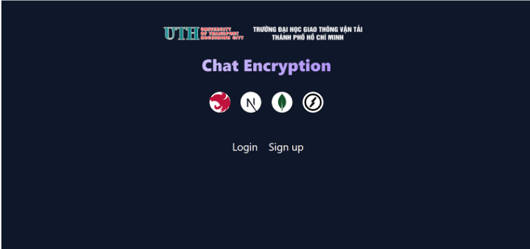
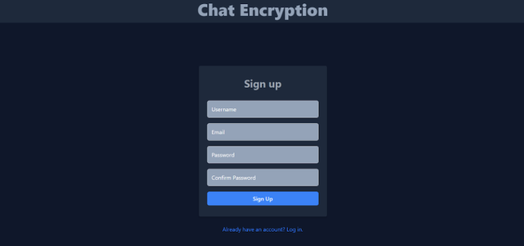
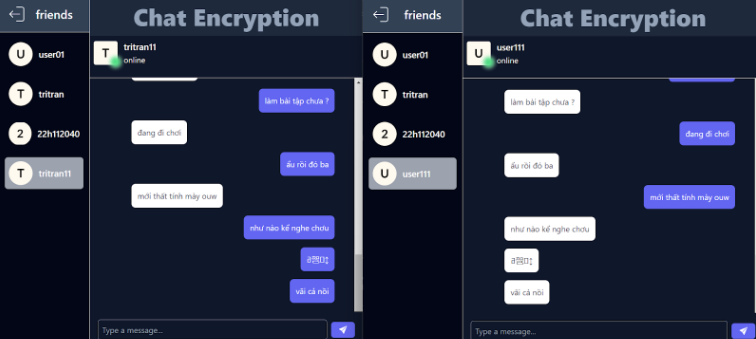
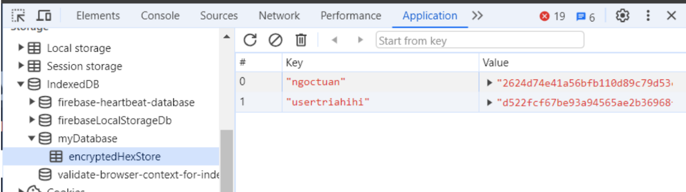
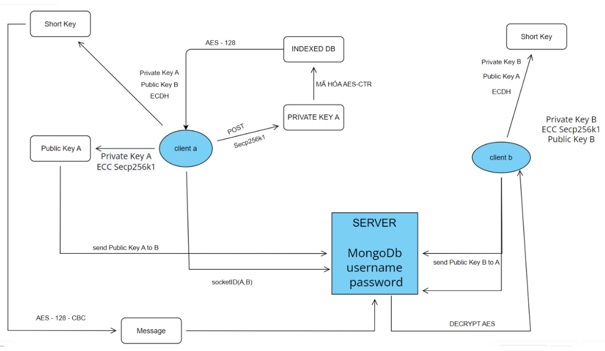

**ChatE2EE - End-to-End Encrypted Realtime Chat App**

A secure, real-time chat application implementing **End-to-End Encryption (E2EE)** with elliptic curve cryptography and AES encryption. Built with **Next.js** (frontend), **NestJS** (backend), and **MongoDB**, this project demonstrates a fully functional messaging system with user authentication, message encryption, and real-time communication via WebSockets.

---

## 🔐 Features

* **End-to-End Encryption (E2EE):** Messages are encrypted on the client using AES-128 (CTR mode) and ECC key pairs, then sent securely to the recipient.
* **ECC + Diffie-Hellman Key Exchange:** Uses elliptic curve cryptography (secp256k1) and ECDH to derive shared secrets between users.
* **User Authentication:** Local strategy with hashed password, session-based login, and guards for route protection.
* **Real-time Messaging:** Built with Socket.io to support instant message delivery.
* **MongoDB Integration:** Stores users, conversations, and messages efficiently with Mongoose schemas.
* **Private Key Management:** Private keys are securely encrypted and stored locally in IndexedDB (browser-side).

---

## 🧱 Tech Stack

* **Frontend:** Next.js, Tailwind CSS, React Hooks, Socket.io-client
* **Backend:** NestJS, Mongoose, PassportJS, Socket.io, AESjs, bcrypt
* **Database:** MongoDB (with Mongoose ODM)
* **Cryptography:** AES-128, ECC secp256k1, ECDH (Elliptic Curve Diffie-Hellman)

---

## 📁 Project Structure (Backend - NestJS)

```
src/
├── auth/              # Auth strategies, guards, and sessions
├── users/             # User schema, service, and controller
├── chat/              # Conversation and message handling
├── main.ts            # App entry point
├── app.module.ts      # Root module
```

---

## 🔑 Encryption Flow (Frontend-side)

1. User registers → ECC private key is generated.
2. Private key is AES-encrypted and stored in browser's IndexedDB.
3. Public key is derived and uploaded to server.
4. When sending a message:

   * Shared secret is derived using ECDH.
   * Message is AES-encrypted with shared secret.
   * Encrypted message is sent via WebSocket.
5. When receiving:

   * Shared secret is derived again.
   * Message is decrypted and rendered.

---

## 💬 Real-Time Chat System

* Each message includes `senderId`, `receiverId`, and `encrypted message`.
* Messages are stored encrypted in MongoDB.
* Conversations store `participants` and related message IDs.

---

## 🚀 How to Run

### Backend

```bash
# Install dependencies
npm install

# Setup MongoDB connection in .env
MONGODB_URI=mongodb://localhost:27017/chatE2EE

# Run in development
npm run start:dev
```

### Frontend

```bash
# Install dependencies
npm install

# Start development server
npm run dev
```

---

## 🧪 Testing

* Auth flow: Login, session, and protected routes
* IndexedDB: Encrypted key storage
* Message exchange: Encryption and decryption between users

---

## 📷 UI Highlights











---

## 📜 License

MIT

**Author:** Trần Trọng Trí
